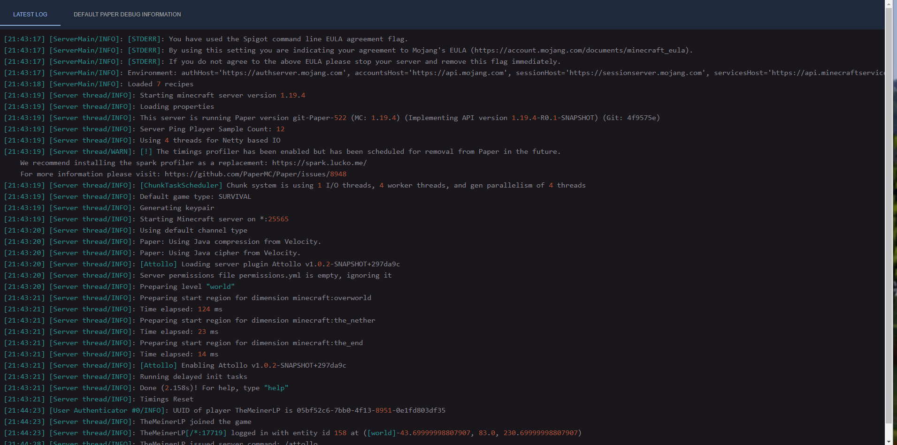
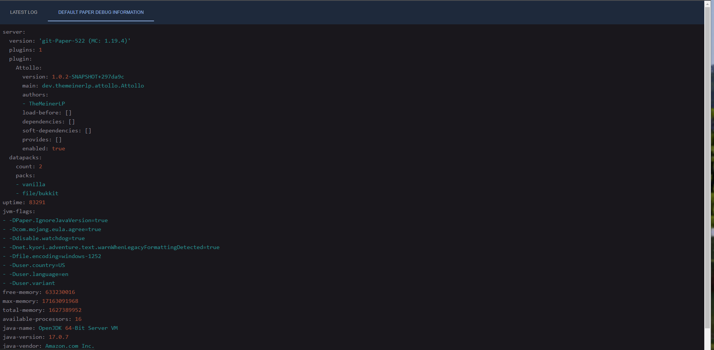

# Plugin Debug Viewer 
This is a simple web app to parse debug.zip from our [plugin debug library](https://github.com/OneLiteFeatherNET/Plugin-Debug).  
You can use this web app for free everytime if you need it.  


## Motivation
When some plugin developer need detailed information about customer server so now this UI shows it in combination of a bytebin server.

## Public instance
We provide a hosted url under https://debugpaste.onelitefeather.net/

### Usage of public instance
Replace `<byteBinCode>` with your code from bytebin server and replace `<bytebinServer>` with your hosted instance. 
`<bytebinServer>` **must be an encoded url**
```
https://debugpaste.onelitefeather.net/#/<byteBinCode>/<bytebinServer>/
```

### UI Example
Latest Log from Paper

Debug Information

The tabs on tab will automatic generated based on delivered information from debug.zip. 

## Build from source
Required:
- Node 19+

Run following commands to build it local:
```shell
git clone git@github.com:OneLiteFeatherNET/Plugin-Debug-Viewer.git && cd Plugin-Debug-Viewer
npm install
npm run build
```
Then copy from `build` folder the files into your webserver and enjoy it.


## Run self-hosted
We provide a docker container and a docker-compose file out of the box.
- Soon if some issue got open
